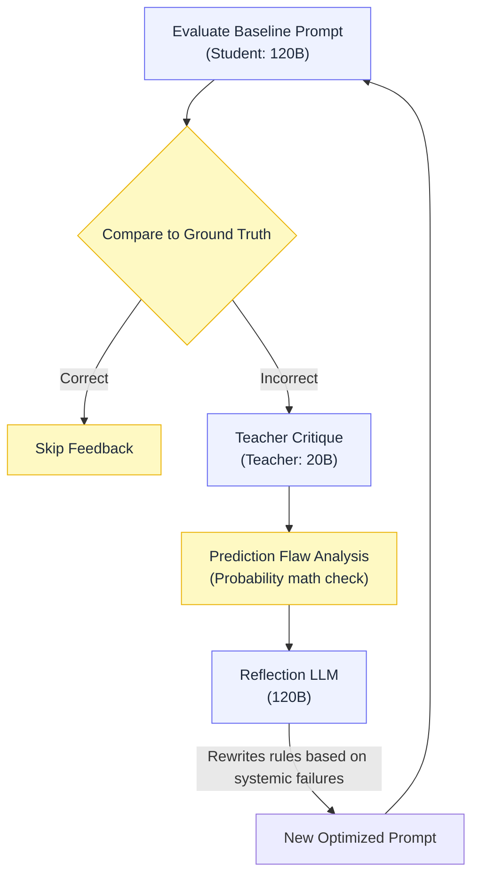

  

<h1 align="center">
  <a href="https://genentech.github.io/BioReasoningChallenge/" style="text-decoration: none; color: inherit;">MLGenX Bio Reasoning Challenge ↗️</a>
</h1>

  Predicting gene expression changes from CRISPRi perturbations in mouse bone marrow-derived macrophages (BMDMs) using DSPy-optimized prompts and fine-tuned LLMs.

  
  
  

## Project Highlights

| Track | Stack | Purpose |
|---|---|---|
| **Track A: Prompt Optimization** |  DSPy, GEPA, GPT-OSS-120B | Automatically optimize the biological reasoning instructions for a 120B parameter model using Generative Error-driven Prompt Adaptation (GEPA). |
| **Track C: Fine-Tuning** |  Qwen 3.5 9B | Fine-tune a compact (<10B) open-weights LLM to intrinsically learn the causal gene networks without relying on complex runtime prompts. |

## Overview

Participants are given (perturbation, gene) pairs and must predict a **ternary** effect on the target gene: `up`, `down`, or `none`. 

Submissions provide two probabilities per row: `prediction_up` and `prediction_down` (where `P(none) = 1 - P(up) - P(down)`). Models are evaluated using the average of Differential Expression (DE) AUROC and Direction (DIR) AUROC against ground-truth CRISPRi labels.

## Track A: Prompt Optimization Architecture

To maximize the zero-shot capabilities of the 120B parameter model, we use an automated prompt optimization loop (GEPA) that iteratively improves the biological reasoning instructions.

* **Student Model (120B):** Generates biological reasoning traces and raw log-probabilities for the final ternary decision.
* **Teacher Model (20B):** Analyzes the student's failures and writes a mechanistic critique of what biological pathway was missed.
* **Reflection Engine:** Synthesizes the teacher's critiques and the probability math to surgically rewrite the seed instructions to prevent future hallucinations.
