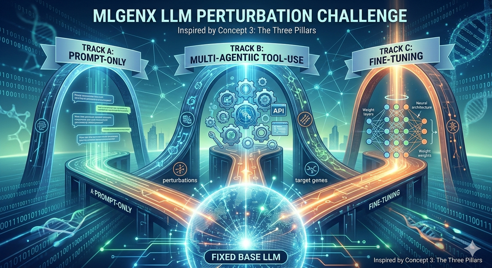

# BioReasoning Challenge -- MLGenX LLM Perturbation Competition

  

Predict gene expression changes from CRISPRi perturbations in mouse bone marrow-derived macrophages (BMDMs).

## Website

Please checkout [the website](https://genentech.github.io/BioReasoningChallenge/) for full details!

## Overview

Participants are given (perturbation, gene) pairs and must predict a **ternary** effect on the target gene:

- **up** — upregulated
- **down** — downregulated
- **none** — not significantly affected

Ground-truth labels use a **5% FDR** threshold and **|shrunken log2FC| >= log2(1.5)**.

Submissions provide two probabilities per row: `prediction_up` and `prediction_down`. P(none) is implicitly `1 - prediction_up - prediction_down`.

The competition is hosted on Kaggle with three separate tracks:

| Track | Name             | Model                       | Key constraint                         |
| ----- | ---------------- | --------------------------- | -------------------------------------- |
| A     | Prompt-only      | GPT-OSS-120B (fixed)        | Single prompt, 3 seeds, no tools       |
| B     | Agentic tool-use | GPT-OSS-120B (fixed)        | Tools allowed, max 250 calls           |
| C     | Fine-tuning      | Open model < 10B parameters | Any fine-tuning, no tools at inference |
