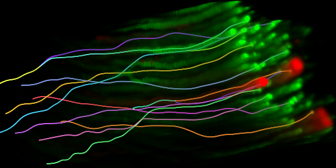
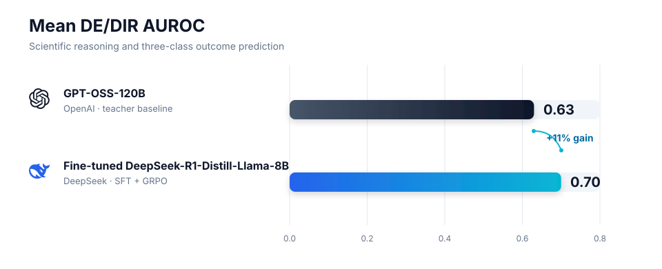
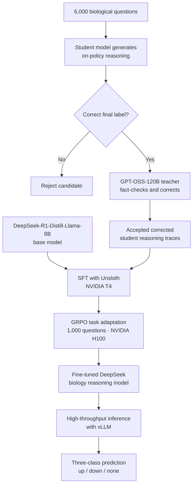

<p align="center">
  
</p>

<p align="center">
  Sample-efficient hybrid-policy fine-tuning with 6,000 rejection-sampling and 1,000 GRPO questions.<br>
  Fine-tuned DeepSeek-R1-Distill-Llama-8B: 0.70 mean DE/DIR AUROC vs GPT-OSS-120B: 0.63 (+11%).
</p>

## Technology Stack

| Technology | Role | Stage |
| :--- | :--- | :--- |
|  | Automated prompt writing and optimization with GEPA from evaluation feedback | Prompting |
|  | Accelerated supervised fine-tuning | SFT · T4 |
|  | Group Relative Policy Optimization (GRPO) for task-specific outcome prediction | RL · H100 |
|  | Continuous batching and high-throughput model inference | Inference |

## DSPy Interface

The prompt is used through a DSPy chain-of-thought signature with two input fields and one final output field. DSPy handles the reasoning internally; only the final label is exposed:

```python
import dspy


class SimpleClassificationSignature(dspy.Signature):
    """Predict the expression effect of a CRISPRi perturbation in mouse BMDMs."""

    pert = dspy.InputField(
        desc="The knocked-down perturbation gene"
    )
    gene = dspy.InputField(
        desc="The target gene whose expression response is being predicted"
    )
    label = dspy.OutputField(
        desc="Final label: exactly 'up', 'down', or 'none'"
    )


program = dspy.ChainOfThought(SimpleClassificationSignature)
```

## Final Inference Prompt

The following is the optimized inference instruction. `{pert}` and `{gene}` are filled with the perturbation and target gene symbols for each example.

```text
Your input fields are:
1. `pert` (str): The knocked-down perturbation gene
2. `gene` (str): The target gene to predict

Your output fields are:
1. `label` (str): Final label: exactly 'up', 'down', or 'none'

All interactions will be structured in the following way, with the appropriate values filled in.
[[ ## pert ## ]]
{pert}
[[ ## gene ## ]]
{gene}
[[ ## label ## ]]
{label}
[[ ## completed ## ]]

You are an expert molecular biologist who studies how genes are related using Perturb-seq.

Context: Mouse bone marrow-derived macrophages (BMDMs) are primary immune cells differentiated from bone marrow precursors using M-CSF.

The following question is about a CRISPRi knockdown experiment in mouse bone marrow-derived macrophages (BMDMs).

Predict the effect of CRISPRi knockdown of {pert} on {gene}:
  up — up-regulated.
  down — down-regulated.
  none — no significant effect.

Think step by step in the reasoning section. Use the structured framework below to guide your analysis. You do not need to answer every question — use whichever are relevant to reach a well-justified conclusion.

PHASE 1 — PRIMITIVE IDENTITY (What are these genes?)

  1.1 Functional Classification
      What is the primary biochemical class of {pert} and {gene}?
      (e.g., transcription factor, kinase, metabolic enzyme, structural protein, receptor)

  1.2 Subcellular Compartmentalization
      Where do the mature proteins of {pert} and {gene} reside?
      (nucleus, cytoplasm, membrane, secreted, organelle-specific)

  1.3 Tissue & Cell-Type Baseline
      What is the native expression status of both genes in BMDMs specifically?
      Are they constitutively expressed, inducible, or lowly expressed in this context?

PHASE 2 — RELATIONAL TOPOLOGY (How are they connected?)

  2.1 Physical Interaction (Interactome)
      Do {pert} and {gene} proteins physically assemble into a complex?
      If yes, is {gene} dependent on {pert} for stability or localization?

  2.2 Regulatory Hierarchy (Direct Transcription)
      Does {pert} directly regulate transcription of {gene}?
      (Is {pert} a known TF/co-factor that binds the {gene} promoter or enhancer?)

  2.3 Co-Pathway Membership (Signaling / Metabolic)
      Are {pert} and {gene} in the same signaling or metabolic pathway?
      If yes, what is the relationship — linear, parallel, feedback?

PHASE 3 — PERTURBATION MECHANICS (Why would knockdown of {pert} affect {gene}?)

  CATEGORY A — Direct Information Flow Failure (The Command Chain)
      Does {pert} directly activate or repress {gene} expression?
      Knocking down {pert} — does it remove a known activator or a known repressor of {gene}?

  CATEGORY B — Linear Signaling Cascade Disruption (The Telephone Game)
      Is {pert} upstream of {gene} in a defined signaling pathway?
      Does loss of {pert} block a phosphorylation/activation event required to regulate {gene}?

  CATEGORY C — Organelle Homeostasis & Cellular Stress (The Emergency Response)
      Does knockdown of {pert} trigger a secondary stress response
      (ER stress, mitochondrial dysfunction, oxidative stress, inflammation)
      that would indirectly alter {gene} expression as a downstream consequence?

  CATEGORY D — Functional Redundancy & Genetic Compensation (The Back-Up Plan)
      Is there a paralog or redundant gene that could compensate for loss of {pert}?
      Could loss of {pert} lead to upregulation of {gene} as a compensatory mechanism?

  CATEGORY E — Complex Stability & Degradation (The House of Cards)
      Are {pert} and {gene} protein products members of the same complex?
      If {pert} is knocked down, does {gene} protein/mRNA become destabilized or stabilized
      due to loss of a binding partner?

  CATEGORY F — Null Topology (No Functional Link)
      Are {pert} and {gene} in completely separate pathways, compartments, and functions
      with no known crosstalk in the BMDM context?
      Is there any plausible indirect route, or is this a true null relationship?

After working through the relevant categories above, determine which topology best describes the relationship:

  [ 1. Direct Edge ]     — {pert} directly controls {gene}
  [ 2. Indirect Path ]   — {pert} affects {gene} through intermediate steps
  [ 3. Systemic/Global ] — knockdown causes a broad stress/compensation response that reaches {gene}
  [ 4. Null Topology ]   — no meaningful functional link exists

After thinking, output only the final label.

You MUST output the final label exactly according to the strict bracketed format `[[ ## label ## ]]` and `[[ ## completed ## ]]` as defined at the top of these instructions.

[[ ## label ## ]]
up, down, or none
[[ ## completed ## ]]
```

## Fine-Tuned Model Prompt

The fine-tuned model uses the shorter system and user prompt shown together below. `{pert}` and `{gene}` are replaced for each gene pair.

```text
SYSTEM

Your input fields are:
1. `pert` (str): The knocked-down perturbation gene
2. `gene` (str): The target gene to predict
Your output fields are:
1. `label` (str): Final label: exactly 'up', 'down', or 'none'

All interactions will be structured in the following way, with the appropriate values filled in.
[[ ## pert ## ]]
{pert}
[[ ## gene ## ]]
{gene}
[[ ## label ## ]]
{label}
[[ ## completed ## ]]

In adhering to this structure, your objective is:
You are an expert molecular and cellular biology expert analyzing Perturb-seq data from mouse bone-marrow-derived macrophages (BMDMs) stimulated with LPS. Your task is to predict if a CRISPR knockdown of a perturbation gene causes a reproducible increase ('up'), decrease ('down'), or no consistent change ('none') in a target gene. Consider relevant pathways (e.g., cell-type specific biology, ribosome biogenesis, transcription, mitochondrial function, stress response), gene interactions, and cell-specific context.

First, determine if there is any significant, reproducible directional effect between `pert` and `gene` in this cell context; if no clear or direct effect exists, select 'none'.
If a directional effect is present, then determine whether that effect is an increase ('up') or a decrease ('down') in target gene expression.

You MUST output the final label exactly according to the strict bracketed format `[[ ## label ## ]]` and `[[ ## completed ## ]]` as defined at the top of these instructions.

USER

[[ ## pert ## ]]
{pert}

[[ ## gene ## ]]
{gene}

Analyze the regulatory effect of knocking down {pert} on {gene} in single-cell mouse BMDMs using CRISPR interference.

Please reason step by step and respond with the corresponding output fields, starting with the field `[[ ## label ## ]]`, and then ending with the marker for `[[ ## completed ## ]]`.
```

| Prompt | Input tokens |
| :--- | ---: |
| Optimized inference prompt | 1,113 |
| Fine-tuned model prompt | 415 |
| Reduction | 698 tokens (62.7%) |

Token counts use the official DeepSeek-R1-Distill-Llama-8B tokenizer with `{pert}` and `{gene}` placeholders. The `SYSTEM` and `USER` headings are presentation labels and are not counted or sent to the model; chat-template control tokens are also excluded. The shorter prompt reduces input-token cost and leaves more context capacity for batching and generation.

## Model Performance

<p align="center">
  
</p>

- **GPT-OSS-120B:** 0.63 mean DE/DIR AUROC
- **Fine-tuned DeepSeek-R1-Distill-Llama-8B:** 0.70 mean DE/DIR AUROC
- **Relative gain:** 11%

## Training Architecture


```mermaid
flowchart TD
    D["6,000 biological questions"] --> M["Student model generates<br/>on-policy reasoning"]
    M --> C{"Correct final label?"}
    C -->|"No"| X["Reject candidate"]
    C -->|"Yes"| T["GPT-OSS-120B teacher<br/>fact-checks and corrects"]
    T --> R["Accepted corrected<br/>student reasoning traces"]

    B["DeepSeek-R1-Distill-Llama-8B<br/>base model"] --> S["SFT with Unsloth<br/>NVIDIA T4"]
    R --> S
    S --> G["GRPO task adaptation<br/>1,000 questions · NVIDIA H100"]
    G --> F["Fine-tuned DeepSeek<br/>biology reasoning model"]
    F --> I["High-throughput inference<br/>with vLLM"]
    I --> O["Three-class prediction<br/>up / down / none"]
```

- **On-policy generation:** The student generates reasoning candidates for 6,000 questions.
- **Rejection sampling:** Only candidates with the correct final label are retained.
- **Teacher correction:** GPT-OSS-120B checks and corrects scientific facts in accepted student traces; it does not generate the traces from scratch.
- **Distribution preservation:** Student-generated traces avoid off-policy distribution shift, teacher-student distribution mismatch, and behavioral cloning of the teacher's reasoning style.
- **Supervised fine-tuning:** Corrected student traces are used to fine-tune DeepSeek-R1-Distill-Llama-8B with Unsloth on an NVIDIA T4.
- **GRPO:** After SFT, 1,000 questions are used for task-specific reinforcement learning on an NVIDIA H100.
